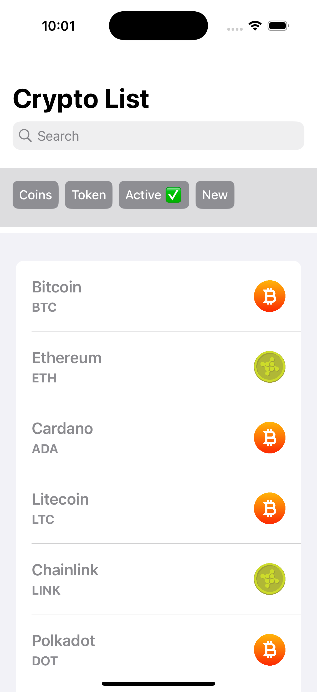

### Crypto Coins
1. List crypto coins with details:
  Name, Symbol, and Type (e.g., Coin/Token).

2. Search by name.
3. Filter:
   By type (e.g., Coin, Token).
   By status (Active/New).

### Architecture
MVVM architecture with Combine for data binding.

### IDE and Language 
• iOS 14.0+

•	Xcode 12.0+

•	Swift 5.3+

Cheers!
